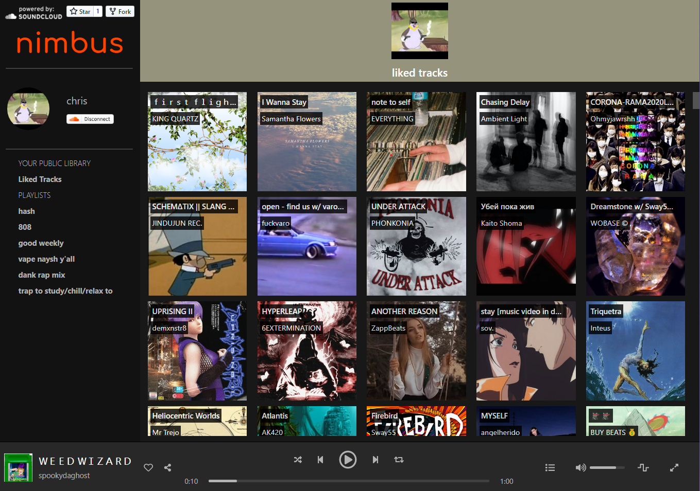

# nimbus

Unofficial Soundcloud client that feels like Spotify with 𝚊𝚎𝚜𝚝𝚑𝚎𝚝𝚒𝚌 features for an 𝚊𝚎𝚜𝚝𝚑𝚎𝚝𝚒𝚌 listening experience.

## wesbite

### nimbus is lightweight
* nimbus is hosted for free on via github at #todo
* no login or authentication required, just copy paste your soundcloud profile url
* nimbus has no ads and no plans of adding any in the future

### limitations
* soundcloud shutdown new app registration 4 years ago, so this project uses a scalped soundcloud key from another open source project
* because I dont have access to my own key, all nimbus functionality is limited to only public information, without the ability to like or follow new things
* **because the key is shared with multiple other projects, the key might hit it's streaming limit for the day and not allow playback for up-to 24 hours**

### fixes from original soundcloud website
* fix shuffle for liked tracks (nimbus queries _all_ your songs with custom shuffling to guarantee a better shuffle)
* full screen album art listening mode

### future plans
* eject from CRA and add WASM functionality for audio spectrum visualization

## developing
1. clone the repo
2. run `yarn install` or `npm insall` (yarn preffered)
3. run `yarn start`
4. ???
5. profit
